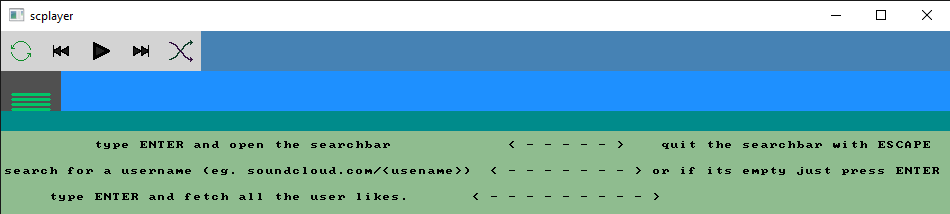
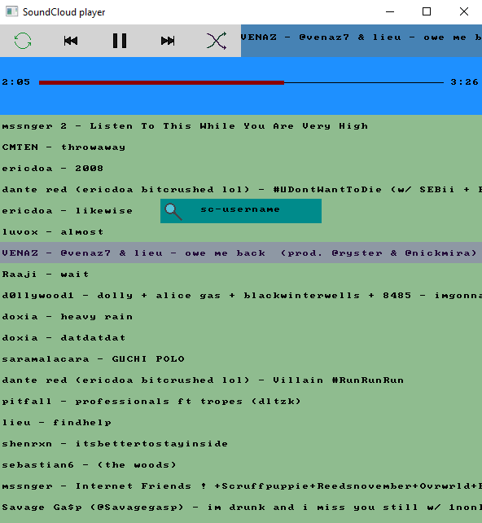

# SC Likes player

```
$ go build
$ ./scplayer
```

This example is a proof of concept that it is still actually possible to make real GUI apps with this package :)

It sure does his job. Try not to rezise it too much. lol.

Thanks [faiface](http://github.com/faiface) allways giving out really good examples that I use as [base project](https://github.com/faiface/gui/tree/master/examples/imageviewer) :')  

### Screenshots







### Main dependencies
 - `github.com/faiface/beep`
 - `github.com/faiface/gui`
 - `github.com/zackradisic/soundcloud-api`
 - `github.com/pbnjay/pixfont`
