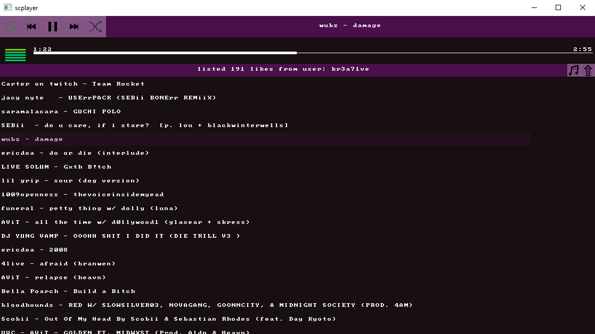

# SC Likes player

```
$ go build
$ ./scplayer
```

This example is a proof of concept that it is still actually possible to make real GUI apps with this package :)

It sure does his job. Try not to rezise it too much. lol.

Thanks [faiface](http://github.com/faiface) allways giving out really good examples that I use as [base project](https://github.com/juanefec/gui/tree/master/examples/imageviewer) :')  

### Screenshots




### TODO:
 - with `tab` open the playlist section on the browser, this displays the the current song and all the ones marked `next` in order
 - fix lots of duplicated code
### Main dependencies
 - `github.com/faiface/beep`
 - `github.com/juanefec/gui`
 - `github.com/zackradisic/soundcloud-api`
 - `github.com/pbnjay/pixfont`
